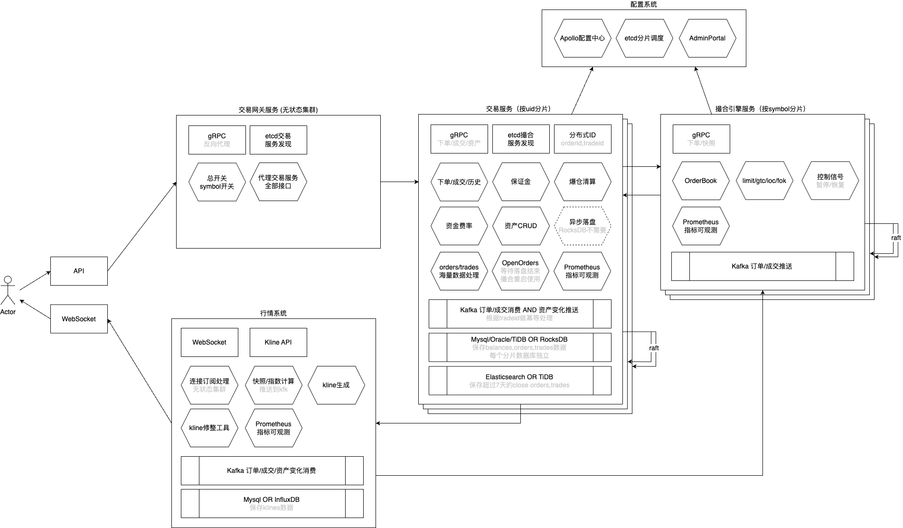

# 分布式高可用交易撮合系统架构设计

交易与撮合系统可以说是中心化加密货币交易所核心系统中的核心，具有高并发、低延迟、分布式、高可用、海量数据、公式复杂的特点，需要组建一支非常有经验的队伍才能真正落地，当时在A公司投入了巨资组建了一个规模空前的团队，大家都寄予厚望，奈何遇上FTX事件导致夭折。

## 架构设计方案

以下是我设计的最新的系统架构，参考了H,A,D三家公司的经验和教训而设计，是对标一线大所的设计方案。

- 交易网关：他存在的主要目的是因为交易服务分片了，需要服务发现才能正确路由到对应的分片。
- 交易服务：包含下单、撤单、成交的所有业务逻辑处理。
- 撮合服务：只根据订单类型做高效订单匹配，匹配成功后通知到交易服务，由交易服务执行业务逻辑。
- 行情系统：消费交易、撮合系统的行情消息(包含用户资产订单持仓变化等)转发给对应的订阅用户。

## 服务的整合与拆分

交易与撮合系统是紧密结合的两个系统，可以分开做，也可以做到一起：

- 做到一个服务：在D公司时我是把他们设计在一起
    - 优点：显而易见的最大程序降低了io交互，并且有着强一致性的特点，运维简单高效。相反在A公司的旧系统中由于拆分过多服务，错综复杂，运维陷入无限痛苦之中，导致每次系统维护都是10h起步。
    - 缺点：当实施分站点，要多个站点使用同一个orderbook时，就很难实现了，在D公司采用了代理下单这种比较绕的方式来解决。
- 分开两个服务：在A,H公司一直是采用分开的设计
    - 优点：由于oderbook的独立设计，任意站点或做市商可以在同一个book上交易，而资产又是分离的。
    - 缺点：交易系统和撮合系统交互非常频繁，又只能是io交互，latency必然变大，同时两个系统之间的数据一致性也需要处理更多的细节，如果程序员经验不足，将会陷入无尽的bug之中，特别是用户资产老是会对不上，当时在A公司的旧系统就是这种情况。

当时在A公司SZ和SG两个团队对该问题也有过激烈的讨论，不过确实分开方案综合更优。

## 分布式设计

其实交易与撮合系统做到一起或者分开，还和分片方案是关联的：

- 做到一个服务：由于orderbook的强顺序匹配，导致撮合系统只能按symbol分片(可多个symbol分为1片)，这导致交易系统也只能和撮合一起，也按symbol分片，我在D公司就是这样做的。
- 分开两个服务：由于服务的拆分，撮合可以按symbol分片，而交易系统的瓶颈是在用户资产的CURD，因此按uid分片更优。

当然如果硬要掰扯，交易与撮合做到一个服务，然后根据symbol分片，按交易对可以分出几百个片，大部分都是量小的，只有BTC,ETH等热门币量大，独立分配一个32核机器给量大的交易对，也是问题不大。

## 内存化处理

全内存化处理能将io降到最低，涉及范围有资产、订单、持仓，而我在D公司的设计其实最大的问题是撮合系统做了内存化，但是交易系统的资产没有内存化。由于按symbol分片导致进一步改造资产内存化实际上将无法实施，这导致单账户单交易对性能瓶颈在数据库行锁的性能，表现就是数据库CPU还没满，但是单用户TPS就压不上去了。如果把资产CURD的io移除，变成内存里面的CURD，TPS将达到极致，因为撮合和交易的整个过程没有io，但设计总是无法完美的，只能取舍。

- 方案1：交易与撮合系统做到同一个服务，只能按symbol分片，下单成交减少了相互操作的io，但是资产无法内存化处理，资产CURD就有io。
- 方案2：交易与撮合系统拆分到两个服务，撮合按symbol分片，交易按uid分片，下单成交避免不了io操作，但是资产可以内存化到分片中。

看上面的最新架构图就知道，方案2天花板更高一些，当然也更贵，需要更多的资深程序员才能搞定。

## 异步落盘

内存化必然带来新的问题，就是数据落盘。

### 关系型数据库

使用传统关系型数据库，为了极致性能固然我们不能同步落盘，而异步落盘就带来了数据一致性，数据库数据延后的问题。

- 当撮合服务Crash：重启需要加载该symbol的全部OpenOrders才能恢复之前的OrderBook，而因为交易服务做了uid分片，所以从交易网关那里直接读取全部分片的订单信息。
- 当交易服务Crash：
  - 订单丢失：创建订单、订单修改的同时记录topic消息，Crash时回放解决一致性。
  - 资产丢失：资产的每一次变更同时记录topic消息，Crash时回放解决一致性。
  - 成交丢失：通过回放撮合成交topic的消息来解决一致性。

这里的一致性处理细节非常多，可以说有些难度，处理不好就会陷入无尽的bug之中。

### 嵌入式数据库

有更简洁的方法，借助rocksdb的一致性，就可以在内存化的同时免去异步落盘。当然任何方案都有优缺点，rocksdb写放大会让磁盘更加容易故障，为了高可用，我们不得不使用raft协议来提交到多个处于不同机器的分片中，实现leader、follower数据同步，显然这复杂度又上来了，因此也需要有实力的资深程序员才能落地。

raft 开源库：

- `java` [sofastack/sofa-jraft](https://github.com/sofastack/sofa-jraft)
- `go` [hashicorp/raft](https://github.com/hashicorp/raft)

## 用户资产设计

当每个部位理论上最优时，瓶颈永远在用户资产这里，因此我见过以下这些方案：

- D公司
  - 现货：只记录散户的资产，量大的做市商直接不记录资产，这样等于90%以上的订单都不处理资产了，自然快速，缺点是给对账带来很多问题。
  - 合约：交易系统没有内存化，直接io操作数据库(异步)，优点是一致性强，缺点是单账户单交易对性能瓶颈。
- A公司
  - 旧系统：内存化后异步落盘，由于复杂度高，系统bug比较多。
- H公司
  - 现货：和D公司合约一样直接使用数据库保存资产。
  - 合约：采用redis来保存资产，对资产做revison标记，同时使用lua来做分布式锁。缺点也是容易出bug。

哪个方案比较好？看我设计的架构图就知道，使用rocksdb的方案显然更优，当然每个公司需要根据团队的实力来选择，适合的才是最好的。

## 撮合引擎服务

架构设计中的撮合引擎只负责订单的高效匹配，不处理资产、持仓等业务逻辑。

如果程序crash怎么办？需要设计一个recovery机制，因此我们需要落盘到数据库。但是由于交易和撮合系统的拆分，两边都各自保存一份订单数据，就一定会有一致性问题发生，因此我最新的架构中没有给撮合设计落盘，而是重启时直接从交易系统中读取symbol的所有OpenOrders来恢复到之前的orderbook状态。

## 部署方案

从架构图中可知，带分片的撮合、交易系统，已经是一个和kafka类似的分布式存储系统，是不适合采用k8s部署的，因此只能使用aliyun ecs,aws ec2来部署，而其他服务都可以采用k8s来部署服务。

## 版权声明

本文章版权归 [https://github.com/onanying](https://github.com/onanying) 所有，任何单位和个人不得转发。
