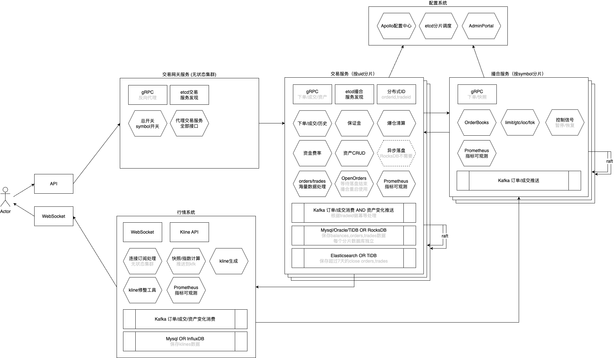

# 高性能撮合与交易系统架构设计

撮合与交易系统可以说是中心化加密货币交易所核心系统中的核心，具有高并发、低延迟、分布式、高可用、海量数据、公式复杂的特点，需要组建一支非常有经验的队伍才能真正落地，当时在A公司投入了巨资组建了一个规模空前的团队，大家都寄予厚望，奈何遇上FTX事件导致夭折。

## 架构设计方案

以下是我设计的最新的系统架构，参考了H,A,D三家公司的经验和教训而设计，是对标一线大所的设计方案。

## 服务的整合与拆分

撮合与交易系统是紧密结合的两个系统，可以分开做，也可以做到一起：

- 做到一个服务：在D公司时我是把他们设计在一起
    - 优点：显而易见的最大程序降低了io交互，并且有着强一致性的特点，并且运维简单高效，在A公司的旧系统中由于拆分过多服务，错综复杂，运维陷入无限痛苦之中，导致每次系统维护都是10h起步。
    - 缺点：当实施分站点，要多个站点使用同一个orderbook时，就很难实现了，在D公司采用了代理下单这种比较绕的方式来解决。
- 分开两个服务：在A,H公司则是分开设计，当时在A公司还有深度讨论过是否做到一起，最终分开设计
    - 优点：由于oderbook的独立设计，任意站点或做市商可以在同一个book上交易，而资产又是分离的。
    - 缺点：交易系统和撮合系统交互非常频繁，又只能是io交互，latency必然变大，同时两个系统之间的数据一致性也需要处理更多的细节，如果程序员经验不足，将会陷入无尽的bug之中，特别是用户资产老是会对不上，当时在A公司的旧系统就是这种情况。

## 分布式设计

其实撮合与交易系统做到一起或者分开，还和分片方案是关联的：

- 做到一个服务：由于orderbook的强顺序匹配，导致撮合系统只能按symbol分片(可多个symbol分为1片)，这导致交易系统也只能和撮合一起，也按symbol分片，我在D公司就是这样做的。
- 分开两个服务：由于服务的拆分，撮合可以按symbol分片，而交易系统的瓶颈是在用户资产的CURD，因此按uid分片更优。

当然如果硬要掰扯，撮合与交易做到一个服务，然后根据symbol分片，按交易对可以分出几百个片，大部分都是量小的，只有BTC,ETH等热门币量大，独立分配一个32核机器给量大的交易对，也是问题不大。

## 内存化处理

而我在D公司的设计其实最大的问题是撮合内存化了但是交易系统的资产没有内存化。由于按symbol分片导致进一步改造资产内存化实际上将无法实施，这导致单账户单交易对性能瓶颈在数据库行锁的性能，表现就是数据库CPU还没满，但是单用户TPS就压不上去了。如果把资产CURD的io移除，变成内存里面的CURD，TPS将达到极致，因为撮合和交易的整个过程没有io，但设计总是无法完美的，只能取舍。

- 方案1：撮合与交易系统做到同一个服务，只能按symbol分片，下单成交减少了相互操作的io，但是资产无法内存化处理，资产CURD就有io。
- 方案2：撮合与交易系统拆分到两个服务，撮合按symbol分片，交易按uid分片，下单成交避免不了io操作，但是资产可以内存化到分片中。

看上面的最新架构图就知道，我现在和来自H公司的架构师想法已经一致，方案2天花板更高一些，当然方案2也更贵，需要更多的资深程序员才能搞定。

## 异步落盘

内存化必然带来新的问题，就是数据落盘。

### 关系型数据库

使用传统关系型数据库，为了极致性能固然我们不能同步落盘，而异步落盘就带来了数据一致性，数据库数据延后的问题。

- 当撮合服务Crash：重启需要加载该symbol的全部OpenOrders才能恢复之前的OrderBook，而因为交易服务做了uid分片，所以从交易网关那里直接读取全部分片的订单信息。
- 当交易服务Crash：
  - 订单丢失：创建订单、订单修改的同时记录topic消息，Crash时回放解决一致性。
  - 资产丢失：资产的每一次变更同时记录topic消息，Crash时回放解决一致性。
  - 成交丢失：通过回放撮合成交topic的消息来解决一致性。

这里的一致性处理细节非常多，可以说有些难度，处理不好就会陷入无尽的bug之中。

### 嵌入式数据库

有更简洁的方法，借助rocksdb的一致性，就可以在内存化的同时免去异步落盘。当然任何方案都有优缺点，rocksdb写放大会让磁盘更加容易故障，为了高可用，我们不得不使用raft协议来提交到多个处于不同机器的分片中，实现leader、follower数据同步，显然这复杂度又上来了，因此也需要有实力的资深程序员才能落地。

raft 开源库：

- `java` [sofastack/sofa-jraft](https://github.com/sofastack/sofa-jraft)
- `go` [hashicorp/raft](https://github.com/hashicorp/raft)

## 用户资产设计

当每个部位理论上最优时，瓶颈永远在用户资产这里，因此我见过以下这些方案：

- D公司
  - 现货：只记录散户的资产，量大的做市商直接不记录资产，这样等于90%以上的订单都不处理资产了，自然快速，缺点是给对账带来很多问题。
  - 合约：交易系统没有内存化，直接io操作数据库(异步)，优点是一致性强，缺点是单账户单交易对性能瓶颈。
- A公司
  - 旧系统：内存化后异步落盘，由于复杂度高，系统bug比较多。
- H公司
  - 现货：和D公司合约一样直接使用数据库保存资产。
  - 合约：采用redis来保存资产，对资产做revison标记，同时使用lua来操作数据保持一致性。缺点也是容易出bug。

哪个方案比较好？看我设计的架构图就知道，使用rocksdb的方案显然更优，当然每个公司需要根据团队的实力来选择，适合的才是最好的。

## 部署方案

从架构图中可知，带分片的撮合、交易系统，已经是一个和kafka类似的分布式存储系统，是不适合采用k8s部署的，因此只能使用aliyun ecs,aws ec2来部署，而其他服务都可以采用k8s来部署服务。

## 版权声明

本文章版权归 [https://github.com/onanying](https://github.com/onanying) 所有，任何单位和个人不得转发。
